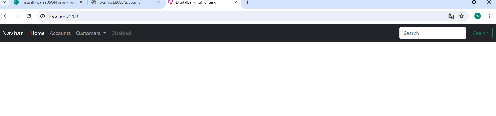
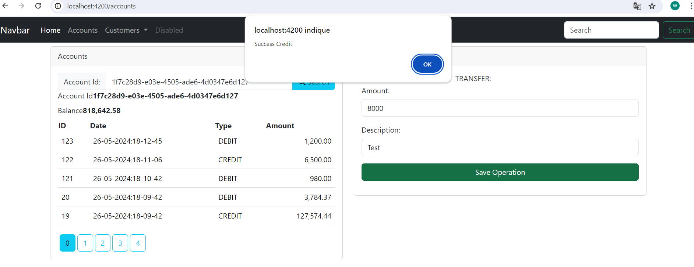

<h1>Projet E-banking Partie 2: <i>FrontEnd</i></h1>
<h2>Objectif de cette partie</h2>

L'objectif de cette partie est d'implémenter la partie frontend 
de l'application E-banking grâce à <i>Angular</i> en établissant un lien entre la partie
Backend et la partie Frontend et en créant components pour chaque partie
comme accounts, customers, navbar et services pour respecter les bonnes pratiques en séparant chaque partie

<h2>Components de notre application:</h2>

<h2>Les interfaces de notre application:</h2>
<h3>Notre menu</h3>

<h3>Customers</h3>

<h3>Ajouter customer</h3>

<h3>Exemple d'un account</h3>

<h3>Si on choisi transfer account Destination s'affiche </h3>

<h3>Exemple d'une operation debit</h3>

